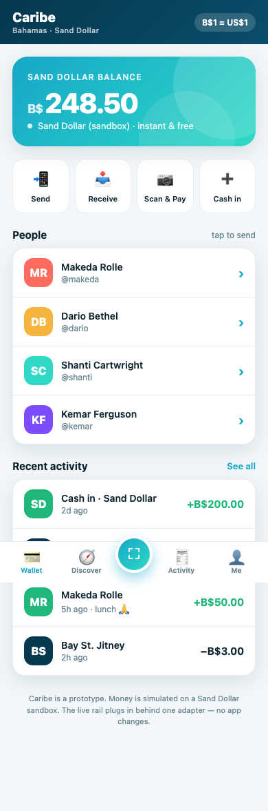
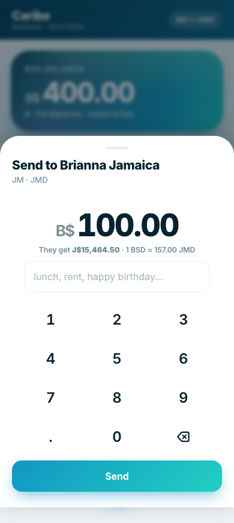
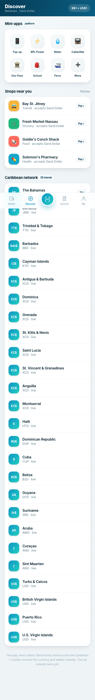
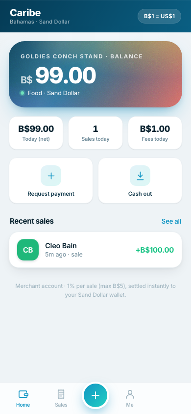
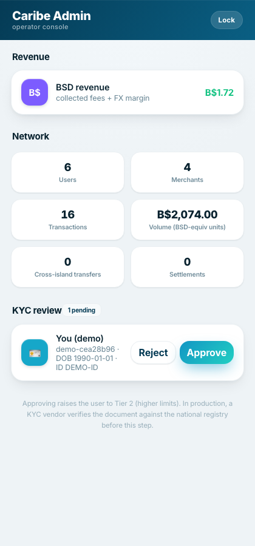
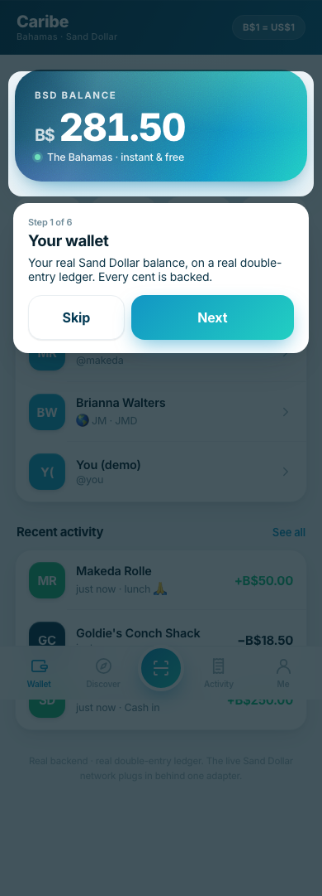

# Caribe 🌊

**The everything app for the islands.** A WeChat-style super-app for the Caribbean — pay,
send, bills, shops, and money that moves *between* islands — built as a network of nodes on
one platform core, starting on the Bahamian **Sand Dollar**.


> **Status:** production-ready *software* (hardened, tested, deployable). Taking real
> deposits additionally needs a money-transmitter license, live rail credentials, a KYC
> vendor, and a reserve bank — legal/credential steps, not code. Run it as a pilot today.

|  |  |  |
|---|---|---|
|  |  |  |
| Wallet | Cross-island send (live FX) | 26-island network |
|  |  |  |
| Merchant dashboard | Operator console | Guided demo |

## Try it in 30 seconds

```bash
git clone https://github.com/jrennie99-glitch/caribe && cd caribe
npm start                      # → http://localhost:8080  (tap "Try the live demo")
```
Want a public link to text someone? `brew install cloudflared && npm run live`.

## What it does (all real, no mocks)

- **Messaging** — real-time 1:1 + group chat (Server-Sent Events, no polling), with
  **send-money-in-chat** tied to the wallet.
- **Voice & video calls** — WebRTC (STUN out of the box; set `TURN_*` env for full NAT
  coverage). Audio/video, mute, camera toggle, incoming-call accept/decline.
- **Ask Caribe** — an AI money assistant: "send 20 to Makeda", "how much did I spend?" —
  natural language that executes real actions. (WeChat has nothing like it.)
- **Spending insights** — real analytics on your ledger: weekly spend, trend, by category,
  top payees, fees.
- **Moments** — a social feed: post, like, comment.
- **Mini-app platform** — merchant storefronts with in-app commerce (browse → buy → instant
  settlement); the foundation others build services on.
- **Wallet** on a real double-entry ledger — every cent is backed (provable, see below).
- **Send / pay / bills / gift envelopes / Scan & Pay** (real QR + camera scanning).
- **Cross-island transfers** — send from a Bahamas wallet to a Jamaica wallet; currency
  converts at live FX with a transparent margin, settled atomically.
- **Merchant app** — business onboarding, dashboard (today's net/sales/fees), QR charging.
- **26-island network** — every Caribbean territory as a node with its own currency + rail.
- **Revenue engine** — per-transaction fees + FX margin, with an operator **admin console**.
- **KYC pipeline** — age/ID checks, document upload, review → tier upgrade.
- **Demo mode + guided tutorial** for showing it off.

## Why you can trust the money

Every transaction is atomic double-entry; transfers are idempotent and overdraft-safe.
A **money-conservation invariant** runs continuously: within each currency, the sum of all
balances is exactly zero. `GET /api/health` reports it. The test suite asserts it across
transfers, fees, and cross-island FX.

```bash
npm test     # 12 tests: ledger, fees (caps/mins), FX, auth, conservation
```

## Run / deploy

| Goal | How |
|------|-----|
| Local | `npm start` |
| Public demo link (no account) | `npm run live` (Cloudflare quick tunnel) |
| Permanent (Docker + auto-HTTPS) | `docker compose up -d` — see [DEPLOY.md](DEPLOY.md) |
| Permanent (Fly.io) | `fly deploy` — see [DEPLOY.md](DEPLOY.md) |

No external dependencies: the backend uses Node's built-in `node:sqlite` (Node ≥ 22.5).

## Architecture

```
server/
  server.js   ← hardened HTTP server (headers, rate-limit, graceful shutdown)
  config.js   ← env config (prod fails closed without secrets)
  db.js       ← SQLite schema + migrations + per-currency system accounts
  auth.js     ← scrypt PIN hashing + HMAC tokens + admin key
  ledger.js   ← double-entry accounting, FX cross-border, conservation
  fees.js     ← revenue schedule (one place to reprice)
  islands.js  ← the 26-island registry (currency, FX rate, rail)
  rail.js     ← Sand Dollar adapter (settlement engine ↔ live CBDC, one swap)
  api.js      ← request handlers
js/           ← installable PWA (wallet, merchant, admin, demo, tutorial)
```

**The network design:** the platform core is identical on every island; each island is an
*adapter* (its currency + rail + regulator). Build once, deploy per island, connect them
into a network. Cross-island FX is the layer nobody owns yet.

## Going live on a real rail

Implement the three methods in `server/rail.js → SandDollarRail` and set `SD_BASE_URL` +
`SD_API_KEY`. The app auto-selects the live rail. Repeat per island as each comes online.

## License

Proprietary — see [LICENSE](LICENSE). © 2026 Caribe.
